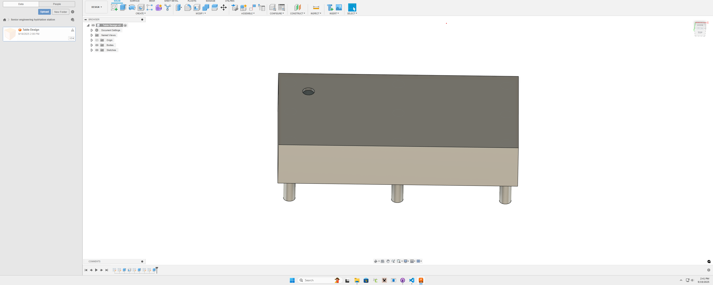

## September 18th 2025
Today I started work on my senior engineering project. I am building a coffee table that will have an automatic water pouring system so when you put a glass on the cupholder it will pour water into it. Today I designed a simple coffee table on fusion 360. I used tools such as loft, rectangular pattern, and extrtude. I have learned to use these tools in previous classes at latin. 

 ## September 30th 2025
 Today we were working on the Owl led light pannel. We have been working on this for a few days now so I was almost done with it before class started. I put the last piece on and then plugged it in and it did not turn on. I did some trobuleshooting but couldnt find the problem so it must have been a fried mount or somethinng lie that. So I had to get a new Owl to restart because it is required which is a setback but will get it done. 
 ## October 1st 2025
 Today I did reaserch on my final project. I looked into table designs and how to do some simple wood working. I have done wood working in the past but nothing like a table so this will be a little more complex and larger. I found a few youtube vidoes today on table desings and build process which I will defintaly be incorperated in my deisgn. [**Youtube coffee table design**](https://www.youtube.com/watch?v=g0LAd-i_9qA&t=230s)
## October 6th 2025
Today I went into the wood shed out back to check out what we had to use. There was alot of wood but not much wood that would fit well for my project so I mnay have to buy some wood. 
## October 7th 2025
Today I Labled some pieces of wood in the shed and also worked on some GIT stuff today. 
## October 9th 2025
Today I did some design specifications and did a deeper dive into the tools and resources I need to build the **Hydration Station**. I started to gather a list of components and wood that I need. 